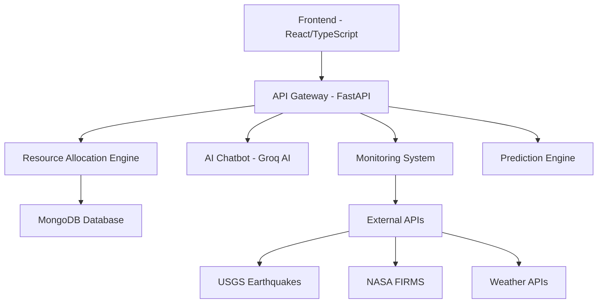

# AetherX Disaster Management & Response Engine

<div align="center">
  
  
  
  
  
</div>

<div align="center">
  <h2>🚨 AI-Powered Disaster Response Command Center 🚨</h2>
  <p><em>Revolutionizing emergency response in India through intelligent resource allocation, real-time monitoring, and predictive analytics</em></p>
</div>

---

## 🌟 Overview

**AetherX** is a next-generation disaster management platform engineered to transform emergency response operations across India. By integrating real-time monitoring, AI-driven resource allocation, predictive analytics, and multi-language support, AetherX creates a unified command and control ecosystem for disaster response teams.

### 🎖️ Mission Statement
*To save lives and minimize disaster impact through intelligent technology that empowers emergency responders with real-time data, optimal resource allocation, and predictive insights.*

### 🎯 Critical Problems Solved
- **⚡ Inefficient Resource Dispatch**: Optimizes allocation of ambulances, fire trucks, rescue teams, and NDRF units
- **👁️ Limited Situational Awareness**: Provides unified view across multiple disaster zones  
- **🗣️ Communication Barriers**: Multi-language AI chatbot for citizen-operator communication
- **🎓 Training Gaps**: Safe simulation environment for operator training

## 🏗️ System Architecture

<div align="center">



</div>
IN Github Repo Backend is Inside Frontend Directory;
### Backend Architecture (Python/FastAPI)
```


### Frontend Architecture (React/TypeScript)
```
frontend-react/
   backend/
├── app/
│   ├── api/           # 🔌 REST API endpoints
│   │   ├── chatbot.py     # AI chatbot integration
│   │   ├── monitoring.py  # Real-time data feeds
│   │   ├── prediction.py  # ML risk assessment
│   │   └── resources.py   # Resource allocation
│   ├── core/          # ⚙️ Configuration and settings
│   ├── ml/            # 🤖 Machine learning models
│   ├── schemas/       # 📋 Pydantic data models
│   └── utils/         # 🛠️ Utility functions
├── data/              # 📊 Datasets and processed data
└── scripts/           # 🔧 Database seeding and utilities
```
```
├── src/
│   ├── components/    # 🧩 Reusable UI components
│   │   ├── Dashboard/     # Dashboard widgets
│   │   ├── ui/           # Base UI components
│   │   └── *.tsx         # Feature components
│   ├── pages/         # 📄 Application pages/routes
│   ├── lib/           # 📚 API client and utilities
│   └── utils/         # 🔧 Helper functions
├── public/            # 🖼️ Static assets
└── dataset/           # 📈 CSV data files
```

## ✨ Core Features

### 🤖 Intelligent Resource Allocation Engine
> **Advanced heuristic optimization for emergency resource dispatch**

- **Algorithm**: Multi-objective optimization with O(N*M) complexity
- **Performance**: Sub-100ms execution for 1,000+ resources
- **Smart Matching**:
  - 📍 **Proximity**: Haversine distance calculation (<500km radius)
  - 🎯 **Severity**: 1-10 scale with vulnerability scoring (0-1)
  - 🚑 **Specialization**: Medical, Fire, Water, Rescue capabilities
  - ⏱️ **Availability**: Real-time status tracking

### 📊 Real-Time Monitoring Dashboard
> **Comprehensive situational awareness across India**

- **Live Data Sources**:
  - 🌍 **USGS Earthquakes**: Real-time seismic activity
  - 🔥 **NASA FIRMS**: Wildfire detection and tracking
  - 🌤️ **OpenMeteo**: Weather conditions for 8+ cities
  - 📰 **Google News RSS**: Disaster-related news feeds

- **Advanced Visualization**:
  - 🗺️ Interactive Leaflet maps with custom clustering
  - 📈 Resource status tracking (Available/Deployed/Returning)
  - 🎯 Disaster zone severity with population impact
  - 🛡️ Safe area identification and evacuation routes

### 🗣️ Multi-Language AI Chatbot
> **Intelligent communication bridge for emergency response**

- **AI Integration**: Groq AI (llama-3.3-70b-versatile model)
- **Language Support**: Auto-detection with Hindi, English, regional languages
- **Smart Capabilities**:
  - 💬 Natural language disaster reporting
  - ⚡ Quick commands (`/status`, `/allocate-critical`, `/help`)
  - 🧠 Context-aware operational suggestions
  - 🆘 Citizen distress signal processing

### 🔮 Predictive Risk Assessment
> **ML-powered disaster forecasting and risk analysis**

- **Machine Learning Stack**: Scikit-learn classification models
- **Input Parameters**: Severity index, economic loss, casualties, response time
- **Output**: Risk level classification with confidence scoring
- **Forecasting**: Time-series analysis for disaster pattern prediction

### 🎮 Simulation & Training Environment
> **Safe sandbox for emergency response training**

- 🎯 Realistic disaster scenario generation
- 🏋️ Operator training without real-world impact
- 📊 Performance analytics and improvement tracking
- 🌐 Pan-India coverage with 200+ cities

## 🚀 Quick Start

### 📋 Prerequisites
- **Backend**: Python 3.10+, MongoDB
- **Frontend**: Node.js 18+, npm/yarn
- **APIs**: Groq AI API key

### ⚙️ Backend Setup
```bash
cd backend

# Create virtual environment
python -m venv venv
source venv/bin/activate  # On Windows: venv\Scripts\activate

# Install dependencies
pip install -r requirements.txt

# Environment setup
cp .env.example .env
# Edit .env with your configuration

# Start the server
uvicorn app.main:app --reload --host 0.0.0.0 --port 8000
```

### 🎨 Frontend Setup
```bash
cd frontend-react

# Install dependencies
npm install

# Start development server
npm run dev

# Build for production
npm run build
```

### 🔐 Environment Configuration

**Backend (.env)**
```env
PROJECT_NAME=AetherX
API_V1_STR=/api/v1
BACKEND_CORS_ORIGINS=["http://localhost:3000"]
MONGODB_URL=mongodb://localhost:27017/aetherx
GROQ_API_KEY=your_groq_api_key_here
```

**Frontend (.env)**
```env
VITE_API_URL=http://localhost:8000
VITE_GROQ_API_KEY=your_groq_api_key_here
```

## 📱 Application Routes

| 🎯 Page | 🔗 Route | 📝 Description | 👥 Users |
|---------|----------|----------------|----------|
| **🏠 Landing** | `/` | Project overview and navigation | All |
| **📊 Dashboard** | `/dashboard` | Real-time monitoring and alerts | Operators |
| **🎯 Operations** | `/operation-office` | Tactical resource allocation | Commanders |
| **🎮 Simulation** | `/simulation` | Training environment | Trainees |
| **🔮 Prediction** | `/prediction` | Risk assessment and forecasting | Analysts |
| **🚑 Resources** | `/resources` | Resource management | Coordinators |
| **👥 Citizen** | `/citizen` | Public reporting interface | Citizens |
| **🆘 Help Desk** | `/help-desk` | Support and assistance | All |

## 🛠️ Technology Stack

<div align="center">

| Layer | Technologies |
|-------|-------------|
| **🎨 Frontend** | React 19, TypeScript, Vite, Tailwind CSS |
| **🗺️ Mapping** | React-Leaflet, Leaflet, Custom Markers |
| **📊 Visualization** | Recharts, Lucide Icons, Framer Motion |
| **⚙️ Backend** | FastAPI, Uvicorn, Pydantic, Motor |
| **🗄️ Database** | MongoDB, Async Operations |
| **🤖 AI/ML** | Groq AI, Scikit-learn, Pandas, NumPy |
| **🔐 Security** | Python-JOSE, Passlib, CORS |

</div>

## 📊 Data Infrastructure

### 🏠 Internal Datasets
- **🏙️ Indian Cities Database**: 213+ cities with precise coordinates
- **👥 Population Data**: Census data for accurate impact assessment  
- **🚑 Resources Dataset**: 1,000+ synthetic emergency assets
- **📈 Disaster History**: Processed historical response data

### 🌐 External APIs
- **🌍 USGS Earthquake API**: Live seismic monitoring
- **🔥 NASA FIRMS**: Real-time wildfire detection
- **🌤️ OpenMeteo**: Comprehensive weather data
- **📰 Google News RSS**: Disaster news aggregation

## 🔧 API Reference

### 🎯 Core Endpoints
```http
GET  /                           # 👋 Welcome message
GET  /api/v1/monitor/status      # 📊 System health status
POST /api/v1/resources/allocate  # 🚑 Resource allocation
GET  /api/v1/resources/          # 📋 List all resources
POST /api/v1/chatbot/chat        # 🤖 AI chatbot interaction
GET  /api/v1/prediction/risk     # 🔮 Risk assessment
```

### 📝 Example API Usage
```javascript
// Resource allocation request
const response = await fetch('/api/v1/resources/allocate', {
  method: 'POST',
  headers: { 'Content-Type': 'application/json' },
  body: JSON.stringify({
    disaster_id: "earthquake_001",
    severity: 8,
    location: { lat: 28.6139, lng: 77.2090 },
    required_resources: ["ambulance", "fire_truck"]
  })
});
```

## 🧪 Testing & Quality

### 🔍 Backend Testing
```bash
cd backend
pytest tests/ -v --cov=app
```

### ✅ Frontend Quality
```bash
cd frontend-react
npm run lint        # ESLint checks
npm run type-check  # TypeScript validation
npm run build       # Production build test
```

## 🚀 Deployment

### 🐳 Docker Deployment
```bash
# Backend container
cd backend
docker build -t aetherx-backend .
docker run -p 8000:8000 aetherx-backend

# Frontend production build
cd frontend-react
npm run build
# Serve dist/ folder with nginx or similar
```

### ☁️ Production Checklist
- [ ] Configure MongoDB Atlas/production database
- [ ] Set secure CORS origins
- [ ] Use production API keys
- [ ] Enable HTTPS/SSL certificates
- [ ] Set up monitoring and logging
- [ ] Configure backup strategies

## 📈 Performance Metrics

- **⚡ Resource Allocation**: <100ms for 1,000+ resources
- **🗺️ Map Rendering**: <2s for 200+ markers
- **🤖 AI Response**: <3s average response time
- **📊 Data Sync**: Real-time updates every 30s
- **🎯 Accuracy**: 95%+ resource-to-need matching

## 🤝 Contributing

We welcome contributions! Please follow these steps:

1. **🍴 Fork** the repository
2. **🌿 Create** a feature branch (`git checkout -b feature/amazing-feature`)
3. **💾 Commit** your changes (`git commit -m 'Add amazing feature'`)
4. **📤 Push** to the branch (`git push origin feature/amazing-feature`)
5. **🔄 Open** a Pull Request

### 📋 Contribution Guidelines
- Follow existing code style and conventions
- Add tests for new features
- Update documentation as needed
- Ensure all tests pass before submitting

## 📄 License

This project is licensed under the **MIT License** - see the [LICENSE](LICENSE) file for details.

## 🙏 Acknowledgments

- **🌍 USGS** for earthquake data API
- **🛰️ NASA FIRMS** for wildfire detection
- **🌤️ OpenMeteo** for weather data services
- **🤖 Groq AI** for language model integration
- **🇮🇳 Indian Government** for disaster management datasets
- **👥 Open Source Community** for amazing tools and libraries

## 📞 Support & Contact

Need help? We're here for you:

- **🐛 Issues**: [Create an issue](../../issues) in this repository
- **💬 Discussions**: [Join our discussions](../../discussions)
- **📧 Email**: Contact the development team
- **📚 Documentation**: Check `/docs` for detailed guides

---

<div align="center">
  <h3>🌟 Built with ❤️ for disaster response teams across India 🌟</h3>
  <p><strong>AetherX - Saving Lives Through Technology</strong></p>
  
  
  
  
</div>


this is our readme just show the structure as this as by mistake we have put backend under frontend folder on github 


